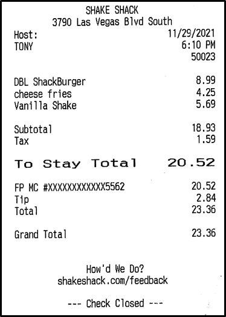
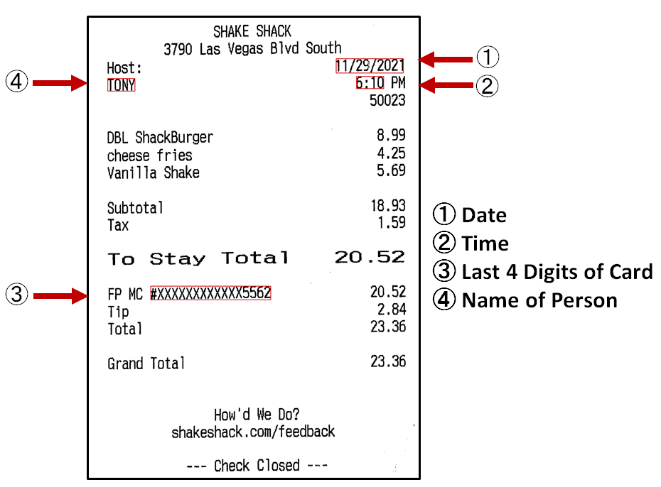

# SPII-Guard
Securing Personal Identifiable Information in Receipts Using Regular Expressions and Named Entity Recognition

SPII Guard is a novel algorithm that can detect sensitive information like the last 4 digits of credit cards, names, dates, and times within images. It was specifically created to address the risk of personal identifiable information in images of receipts falling into the hands of potentially ill-intentioned workers on Crowdsourcing platforms. However, this algorithm has potential for further applications. Future work can include expanding its censuring capabilities to automatically detecting sensitive information in passports, images of credit cards, drivers licenses, tax returns, medical records, and more.

### Original Receipt
 
Original Receipt Credit: Walter, J. (2023)

### Algorithm Output
 
Original Receipt Credit: Walter, J. (2023)
